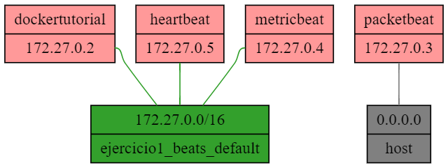

# Bosonit Elastic Course 
## Ejercicio 1 - Beats

En este ejercicio trataremos de realizar la adquisición de cierta paquetería de red, según una serie de condiciones.
El objetivo es evaluar el grado de comprensión en cuanto a configuración y funcionamiento de los beats. 

Para este ejercicio, desplegaremos un `stack` como el de la imagen siguiente, compuesto por:
- `dockertutorial`: Despliega el tutorial web de `docker`
- `packetbeat`: Despliega el beat packetbeat, con el que recopilaremos cierta paquetería de red.
- `heartbeat`: Despliega heartbeat, encargado de comprobar si el servicio `dockertutorial`está escuchando en el puerto 80.
- `metricbeat`: Despliega metricbeat, encargado de recopilar estadísticas de los servicios docker.

*Stack ejercicio1*

### Requisitos:

Para poder realizar el ejercicio, deberá tener instalado y funcionando `docker`.

### Ejercicio

Dados los ficheros de configuración `./conf/packetbeat.yml`, `./conf/heartbeat.yml` y `./conf/metricbeat.yml`, se deberán establecer las propiedades adecuadas para que los diferente servicios puedan realizar las tareas indicadas para cada uno de ellos.

#### Heartbeat
Permitirá comprobar el estado del servicio `dockertutorial`.

1. Se deberá cambiar el output a tipo consola
2. Se deberá comprobar el estado del servicio http://dockertutorial cada 30s

#### Packetbeat
Deberemos de capturar paquetería de red, en concreto, las diferentes peticiones realizadas por `heartbeat` o por acceso de usuario a `dockertutorial` a través del navegador.

1. Establecer el output de tipo file, que se deberá almacenar en `/data` con el nombre `packetbeat.json`
2. Se deberá escuchar cualquier interfaz de red
3. Nos limitaremos a recoger las peticiones dirigidas al puerto 80 
4. Solamente se recopilarán peticiones cuyo método sea "get"

#### Metricbeat
Permitirá comprobar el rendimiento de los servicios.

1. Establecer el output de tipo file, que se deberá almacenar en `/data` con el nombre `metricbeat.json`
2. Cuando se realice un cambio, la configuración deberá recargarse automaticamente
3. Se deberá activar el módulo `docker`y obtener las metricas de:
    - cpu
    - memoria
    - información
4. Se deberá desactivar el módulo `system`

### Ejecución

Este ejercicio se realizará empleando contenedores docker. Para ejecutar el proyecto, en una terminal, navegue hasta la raiz del ejercicio (ejercicio1_beats). Una vez situado, ejecute el comando `docker-compose up -d`

Este comando ejecutará cuatro contenedores:
1. `dockertutorial`, al que podrá acceder desde http://localhost. En el encontrará el tutorial oficial de docker
2. `heartbeat`, que estará realizando comprobaciones del estado del servicio `dockertutorial`
3. `metricbeat`, que estará recopilando métricas de los recursos de sistema
2. `packetbeat`, que estará escuchando en la misma red que esté su dispositivo host y recopilará paquetería de red hacia `docker`.

- Si desea acceder a la terminal del contenedor `dockertutorial`, ejecute: `docker exec -it dockertutorial /bin/sh`
- Si desea acceder a la terminal de otro contendor, ejecute `docker exec -it <nombre_contenedor> /bin/bash`

Para detener el `stack`, en la raiz del proyecto, ejecute `docker-compose down`

#### Tips

1. `hearbeat` estará comprobando el servicio `dockertutorial`, por lo que `packetbeat` deberá poder verlo y recopilar dichos paquetes.
2. Aunque `heartbeat` realice peticiones, puede probar a navegar a http://localhost y ver si se recoge dicha petición por `packetbeat`.
3. Los contenedores de los beats tienen mapeada la carpeta `/data` a una carpeta `./data` dentro del directorio del ejercicio. Ésta se generará durante el primer arranque automáticamente, y ahí se depositarán los ficheros generados por los beats.

### Evaluación

El ejercicio se valorará como "Apto" o "No apto"
Para ser considerado "Apto" se deberá cumplir las siguientes condiciones:
1. Se deberá generar el fichero de configuración `conf/packetbeat.yml` con la configuración especificada.
2. Se deberá generar el fichero de configuración `conf/heartbeat.yml` con la configuración especificada.
3. Se deberá generar el fichero de configuración `conf/metricbeat.yml` con la configuración especificada.
4. se deberá entregar los ficheros de configuración `system` y `docker` de metricbeat